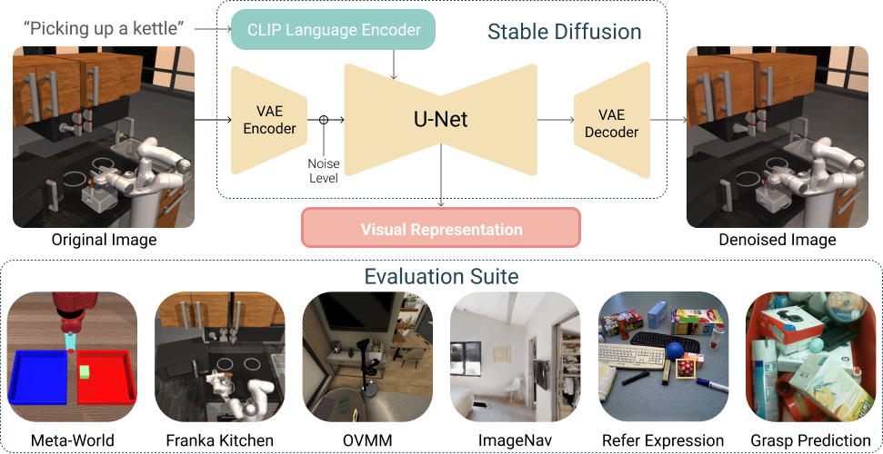

# Stable Control Representations
[Paper Link](https://arxiv.org/abs/2405.05852) | [Model Link](https://huggingface.co/ykarmesh/stable-control-representations)

<p align="center">
  

  <br />
  <a href="./LICENSE"></a>
  <a href="Python 3.8"></a>
  <a href="https://github.com/psf/black"></a>
</p>


Vision- and language-guided embodied AI requires a fine-grained understanding of the physical world through language and visual inputs. Such capabilities are difficult to learn solely from task-specific data, which has led to the emergence of pre-trained vision-language models as a tool for transferring representations learned from internet-scale data to downstream tasks and new domains. However, commonly used contrastively trained representations such as in CLIP have been shown to fail at enabling embodied agents to gain a sufficiently fine-grained scene understanding—a capability vital for control. To address this shortcoming, we consider representations from pre-trained text-to-image diffusion models, which are explicitly optimized to generate images from text prompts and as such, contain text-conditioned representations that reflect highly fine-grained visuo-spatial information. Using pre-trained text-to-image diffusion models, we construct Stable Control Representations which allow learning downstream control policies that generalize to complex, open-ended environments. We show that policies learned using Stable Control Representations are competitive with state-of-the-art representation learning approaches across a broad range of simulated control settings, encompassing challenging manipulation and navigation tasks. Most notably, we show that Stable Control Representations enable learning policies that exhibit state-of-the-art performance on OVMM, a difficult open-vocabulary navigation benchmark

## Installation

Please follow the instructions in [INSTALLATION.md](INSTALLATION.md) to install the model and associated benchmarks.


## Directory structure

- `vc_models`: contains config files for SCR and baseline models, the model loading code and, as well as some project utilities.
    - See [README](./vc_models/README.md) for more details.
- `benchmarks`: embodied AI downstream tasks to evaluate SCR.
- `third_party`: Third party submodules which aren't expected to change often.


## Reproducing Results with the SCR Model
To reproduce the results with the SCR model, please follow the README instructions for each of the benchmarks in [`cortexbench`](./cortexbench/).


## Citing SCR
If you use SCR in your research, please cite [the following paper](https://arxiv.org/abs/2405.05852):

```bibtex
@inproceedings{gupta2024scr,
      title={Pre-trained Text-to-Image Diffusion Models Are Versatile Representation Learners for Control},
      author={Gunshi Gupta and Karmesh Yadav and Yarin Gal and Dhruv Batra and Zsolt Kira and Cong Lu and Tim G. J. Rudner},
      year={2024},
      eprint={2405.05852},
      archivePrefix={arXiv},
      primaryClass={cs.CV}
}
```

## Acknowledgement
We are thankful to the creators of Stable Diffusion for releasing the model, which has significantly contributed to the progress in the field. Additionally, we extend our thanks to the authors of [Visual Cortex](https://github.com/facebookresearch/eai-vc/tree/main) for releasing the code for CortexBench evaluations.
